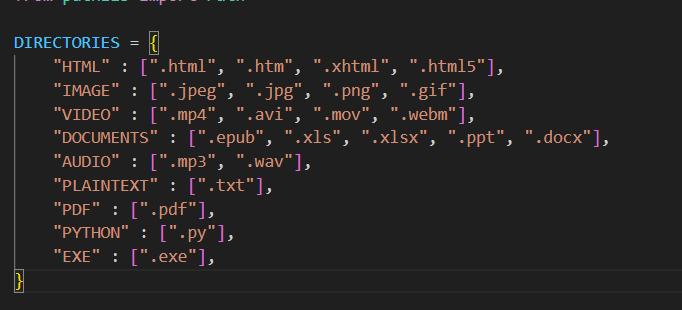

# File Organizer
Easy to use solution for your file orgainzation nightmares.

## Save hours by doing less
- Ensure you have Python installed in your syatem.
- Download the *orgainze_files.py* script.
- Copy & paste the script in folder you want to organize.
- Run it like a normal file.
- See all you file orgainzed in less than a second.

## Supported file formats and directories
Let's see what files will be stored in what folder.
| **Directory Names** | **File Formats** |
|--------------------|------------------|
| HTML               | .html, .htm, .xhtml, .html5 |
| IMAGE              | .jpeg, .jpg, .png, .gif |
| VIDEO              | .mp4, .avi, .mov, .webm |
| DOCUMENTS          | .epub, .xls, .xlsx, .ppt, .docx |
| AUDIO              | .mp3, .wav |
| PLAINTEXT          | .txt |
| PDF                | .pdf |
| PYTHON             | .py |
| EXE                | .exe |
| JAVA               | .java |

## Tutorial

### How to change default directory names
Change the keys in the **DIRECTORIES** dictionary.
### How to add customs file formats
Add your desired directory name and file formats it has to store in the **DIRECTORIES** dictionary.